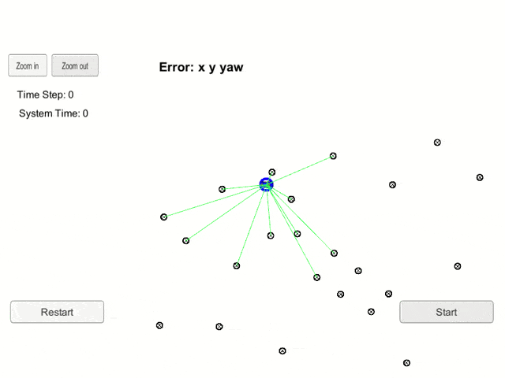
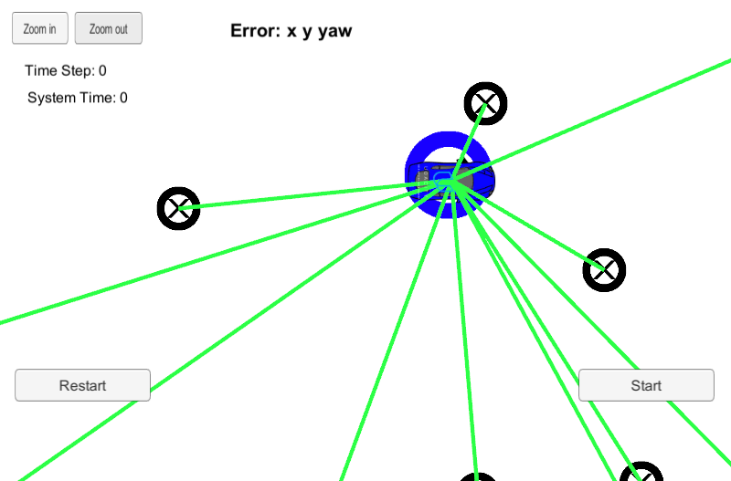

# Kidnapped vehicle
[](LICENSE) [](https://www.codacy.com/manual/frgfm/sdcnd-p6-kidnapped-vehicle?utm_source=github.com&amp;utm_medium=referral&amp;utm_content=frgfm/sdcnd-p6-kidnapped-vehicle&amp;utm_campaign=Badge_Grade)  

Kidnapped vehicle project of Udacity Self-Driving Car Nanodegree (cf. [repo](https://github.com/udacity/CarND-Kidnapped-Vehicle-Project)).




## Table of Contents

- [Getting Started](#getting-started)
  - [Prerequisites](#prerequisites)
  - [Installation](#installation)
- [Usage](#usage)
- [Approach](#Approach)
- [Credits](#credits)
- [License](#license)


## Getting started

### Prerequisites

- [Unity3D](https://unity3d.com/get-unity/download): 3D game engine used for our simulation.
- make (>= 4.1 on Linux, Mac, >= 3.81 on Windows): the buildsystem of the project.
  - Linux: make is installed by default on most Linux distros
  - Mac: [install Xcode command line tools to get make](https://developer.apple.com/xcode/features/)
  - Windows: [Click here for installation instructions](http://gnuwin32.sourceforge.net/packages/make.htm)
- [cmake](https://cmake.org/install/) 3.5 (or newer): buildsystem generator.
  - Any OS: [click here for installation instructions](https://cmake.org/install/)
- [gcc](https://gcc.gnu.org/)/g++ 5.4 (or newer): to compile the C++ code.
  - Linux: gcc / g++ is installed by default on most Linux distros
  - Mac: same deal as make - [install Xcode command line tools](https://developer.apple.com/xcode/features/)
  - Windows: recommend using [MinGW](http://www.mingw.org/)
- [uWebSockets 0.13.0](https://github.com/uNetworking/uWebSockets/archive/v0.13.0.tar.gz): to handle our web-server.
  - Linux/Mac: [click here for installation instructions](https://github.com/uWebSockets/uWebSockets)
  - Windows: use either Docker, VMware, or even [Windows 10 Bash on Ubuntu](https://www.howtogeek.com/249966/how-to-install-and-use-the-linux-bash-shell-on-windows-10/) to install uWebSocketIO
- [json](https://github.com/nlohmann/json): to interact with JSON files *(header-only)*.
  - Any OS: place the [file](https://github.com/nlohmann/json/releases/download/v3.7.3/json.hpp) in the  `include/` folder
- [Catch](https://github.com/catchorg/Catch2): for unittests *(header-only)*
  - Any OS: place the [file](https://github.com/catchorg/Catch2/releases/download/v2.11.3/catch.hpp) in the `lib/` folder
- [spdlog](https://github.com/gabime/spdlog): for console logging *(header-only)*
  - Any OS: extract the [archive](https://github.com/gabime/spdlog/archive/v1.5.0.tar.gz) and place the `include/spdlog` directory in the  `include/` folder

*Note: If you are running a Unix system, the installation scripts in the folder `scripts/` will install all the requirements apart from Unity3D. From the repository's main directory, run `bash scripts/install-linux.sh` for Linux or run `bash scripts/install-mac.sh` for MacOS to install those dependencies.*

### Installation

#### C++

Your folder hierarchy should look like below:

```
.
├── CMakeLists.txt
├── data
│   └── map_data.txt
├── include
│   ├── json.hpp
│   └── spdlog
├── lib
│   └── catch.hpp
├── LICENSE
├── README.md
├── scripts
│   ├── format-project.sh
│   ├── install-cppdeps.sh
│   ├── install-linux.sh
│   └── install-mac.sh
├── src
│   ├── helpers.h
│   ├── main.cpp
│   ├── map.h
│   ├── particle_filter.cpp
│   └── particle_filter.h
├── static
│   └── images
└── test
    ├── helpers_test.cpp
    └── main_test.cpp
```

Now you can build the project:

```bash
mkdir build && cd build
cmake .. && make && cd ..
```


#### Unity

After installing Unity3D, you will need an environment build to run the simulation. Download the appropriate build for your OS and extract it:

- [Linux](https://github.com/udacity/self-driving-car-sim/releases/download/v1.45/term2_sim_linux.zip)
- [Mac](https://github.com/udacity/self-driving-car-sim/releases/download/v1.45/term2_sim_mac.zip)
- [Windows](https://github.com/udacity/self-driving-car-sim/releases/download/v1.45/term2_sim_windows.zip)

If you encounter an issue with the above builds, please refer to the "Available Game Builds" section of this [readme](https://github.com/udacity/self-driving-car-sim).


## Usage

### Unittests

By compiling the project previously, you created 2 executables. One of them is here to run unittests using [Catch2](https://github.com/catchorg/Catch2). In order to run the tests, use the following command:

```bash
build/tests
```

which should yield something similar to:

```shell
===============================================================================
All tests passed (8 assertions in 2 test cases)
```


### Project build

Run the recently built project using the following command:

```
build/ParticleFilter
```

The compiled program is now listening to events on port `4567` using a web server. We just need to run our Unity3D environment to see the results.

- Run the `term2_sim` executable after extracting the environment archive *(you might have to make it executable on Unix systems)*.
- Select the Resolution and Graphics settings for your setup.
- Click on `Next` twice then `SELECT`
- Click on `Start`


## Approach

This project has the particularity of using simulated data for  evaluation, which easily solves the costs of collecting and annotating the data. The environment is not interactive for the user, the only accepted input is the predicted state vector (spatial and angular position) in 2D.

### Environment

This Unity environment provides a set of landmarks located on a map, where a car moves in 2D. 



The environment will have the car follow a predefined trajectory and will expose the sensor measurements to our C++ program.

Please refer to this [repository](https://github.com/udacity/self-driving-car-sim) for further details.


### Implementing a particle filter

We follow the description of the Particle Filter algorithm.


In the `src` folder, you will find:

- `main.cpp`: reads measurement data from Unity3D, runs the particle filter and evaluate the predictions.
- `map.h`: formalizes a landmark class.
- `particle_filters.cpp`: implements the core particle filter prediction steps.
- `helpers.h`: distance & error computation, data reading.


### Results

The previously mentioned implementation yields good performances in regards to L1-distance on the state vector, and the prediction visualized as a blue circle reflects accurately the position and orientation of the car.


The implementation is evaluated using the absolute difference for each state vector's component over the datasets.

| State | Error |
| ----- | ----- |
| x     | 0.113 |
| y     | 0.109 |
| yaw   | 0.004 |

The full-length lap recording in bird-eye view are available for download in the release attachments:

- [Full lap recording](https://github.com/frgfm/sdcnd-p6-kidnapped-vehicle/releases/download/v0.1.0/result.mp4)


## Limitations and improvements

Currently, the implementation feels a bit shaky and could be improved further. Here are a few leads to investigate:

1. Spatio-temporal smoothness: implementing a smoothing mechanism for state prediction could help improve this localization unit.
2. Number of particles: grid-searching the number of particles could help to improve the implementation efficiency.


## Credits

This implementation is vastly based on the following methods:

- Particle Filter: [Nonlinear Filetring: Interacting Particle Resolution (1996)](http://people.bordeaux.inria.fr/pierre.delmoral/delmoral96nonlinear.pdf), [Measure-valued processes and interacting particle systems (1998)](https://projecteuclid.org/download/pdf_1/euclid.aoap/1028903535) 


## License

Distributed under the MIT License. See `LICENSE` for more information.